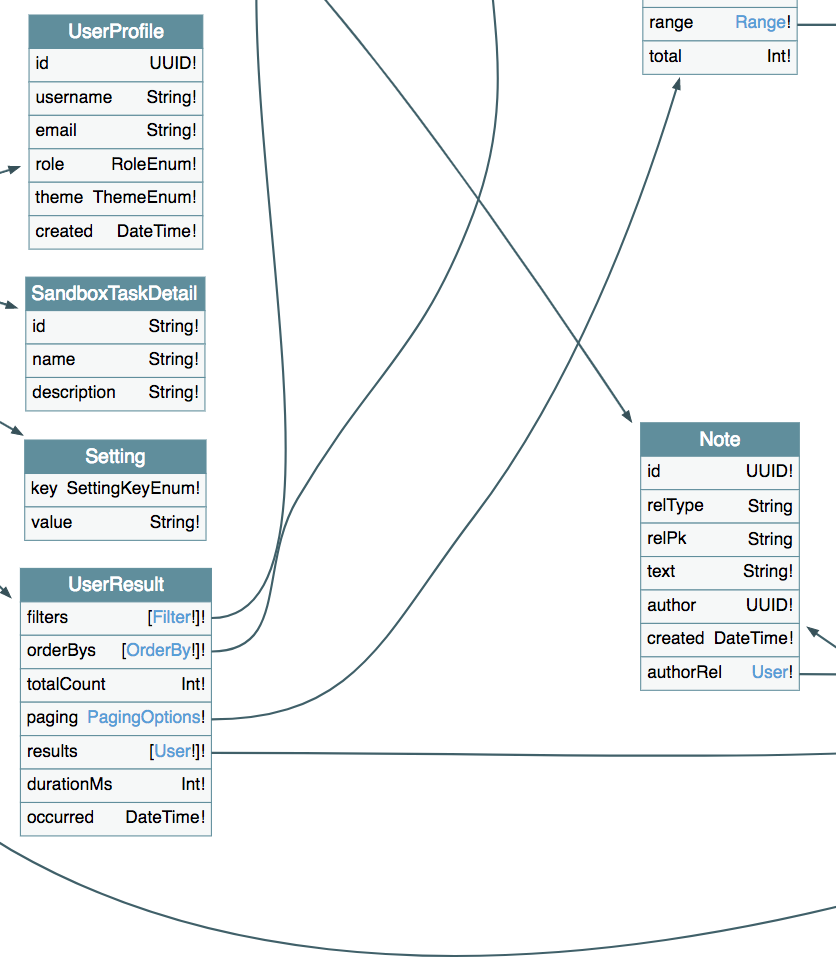

# GraphQL

A GraphQL endpoint is provided by GraphiQL and Sangria, available at `/admin/graphql`. 

Use the following as your first query if you'd like to get started:

```
query FirstQuery {
  profile {
    username
    email
  }
  user(q: "MyUsername") {
    results {
      id
      username
      preferences {
        theme
      }
      noteAuthorFkey {
        text
      }
    }
  }
  audit(orderBy: { col: "userId", dir: Descending}, limit: 10) {
    results {
      id
      act
      app
      client
      server
      userId
      tags {
        k
        v
      }
      msg
      records {
        id
      }
      started
      completed
      auditRecordAuditIdFkey {
        id
        t
        pk
        changes {
          k
          o
          n
        }
      }
    }
  }
}
```

You can also vizualize the schema with GraphQL Voyager by visiting `/admin/graphql/voyager`.



To add your own models and services to GraphQL, start with `Schema.scala`, and check out the classes that are referenced.
