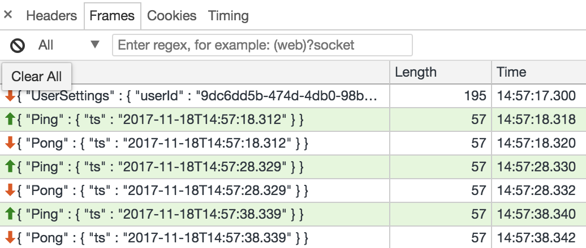

# Serialization

The `RequestMessage` and `ResponseMessage` sealed traits contain classes that can be easily be serialized to JSON via circe or a efficient binary form via BooPickle.

Serialized classes can be passed through [Websockets](websocket.md) or written to disk. See the `JsonSerializers` or `BinarySerializers` classes for usage examples.

