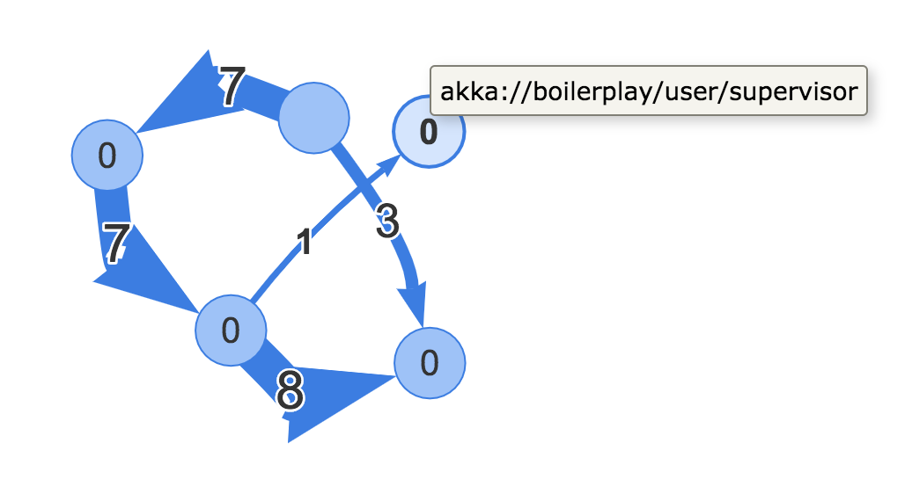

# Actors

Akka actors can be instrumented with metrics by extending `InstrumentedActor`. 

By uncommenting `# default-mailbox.mailbox-type` in `application.conf`, actor message flows can be visualized with `akka-visual-mailbox-visualization`. To enable this, run the following:

```docker run -ti --rm -p 8080:8080 -p 60009:60009/udp ouven/akka-visual-mailbox-visualization```

Then, load http://localhost:8080 to see your actors' message flow.


